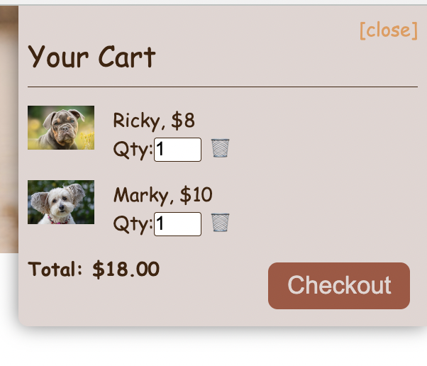

# FuzzyFinder - Your Personal Service Dog Searcher

## Collaborator: Aaron Yacher, Raúl Rangel, Jessie Doherty, James Wong

## License

The MIT License

---

## Concept

A friendly and easy-to-use C2C business for service dog owners and users, where dog owners can make some extra bucks for dog food and toys, and users with temporary needs can get the help from human’s best friends. People can search specialized service dogs in their area and reserve a dog for temporary needs.

## Motivation

- Professionally trained dogs are truly our best friends. They not just serve as companions, but also great helpers!
- During the COVID-19 pandemic, due to social distancing, people with special needs sometimes cannot get enough help; many people have also developed mental or physical problems and need temporary help or emotional support.
- Service dogs are usually offered by facilities under long-term contracts. It is hard to find a Customer-To-Customer (C2C) business for services dogs.
- We hope to offer a C2C business model to connect dog owners and temporary users.

## User story

- `As a service dog owner, I would like to register my dog and offer temporary help to people in need. I can choose my dog’s category and describe my dogs’ specialties. I hope to charge a small fee for the service rendered. `
- `As a person with special needs, I would like to find a professionally trained dog that can help me for a few days. I’m willing to pay for the temporary service I get. `

## Technologies used

MERN Stack, Heroku, Stripe, AWS, GraphQL, JSON, etc.

## Challenges

- Heroku and MongoDB Atlas deployment
- Debugging
- User image uploading

## Plans for future development

- Fix current bugs
- Adding an AI chat box
- Users should be able to add reviews or rate the dogs

## Links:

- [Deployed Heroku site](https://fuzzy-finder.herokuapp.com/)
- [GitHub repo](https://github.com/James-Y-Wong/FuzzyFinder)
- [Presentation](https://docs.google.com/presentation/d/19nHs0qMicPezrtOxDNM84-Hhg5SccFVfMxHPQBNry2U/edit#slide=id.p)

## Snapshot

- 
- 
- 
- 

## Contributing

This repo is open to all public contribution, please feel free to fork or join our development.

## Contact Information

If you have any questions for anyone on our team, our contact information is below. Also be sure to visit our GitHub profiles to see more of our work:

### `Jessie Doherty`

- GitHub: https://github.com/zhuzhu930

- Email: zhuzhu93028@gmail.com

### `Raul Rangel`

- GitHub: https://github.com/rrangel07

- Email: raulanrangel07@gmail.com

### `James Wong`

- GitHub: https://github.com/James-Y-Wong

- Email: jamesyeuwong@gmail.com

### `Aaron Yacher`

- GitHub: https://github.com/aalink

- Email: aaronyacher@gmail.com
